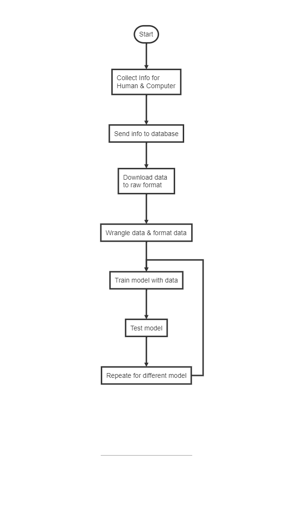

# Introduction

  This paper dives into an approach to build a deep learning model to predict whether or not a human or computer is controlling Mouse. This can be used in many different types of applications such as needing to know whether or not a computer is controlling either filling in website forms or trying to buy up a particular item on the internet. This could also be used to detect if a program is creating a mass amount of accounts on the website that could potentially use some manipulations such as adding likes to a specific person's Instagram. Another application for wanting to know if a human controls a mouse in online gaming.  There's a large black market business out there that can create scripts to automate tasks in a game. Companies spend a great deal in time trying to detect bots to remove them from the game. These bots can manipulate game economies and which could upset people as their time spent playing would not be as valuable causing them to leave the game. This paper will dive into collecting the data from a human and a computer,  cleaning up the data in a format that Tensorflow can digest, build a model around this data, and test to see how well it performs.
  
# Process steps on the project

Here is a diagram and summary it took to complete the project

# Related Work

In 2018 when Facebook got hit by the Cambridge Analytica Scandal it reported that they are collecting lots of data from users such as device information, operating systems, signal strength, battery settings, and even started collecting mouse data[@ganjoo_2018]. With this mouse moving information it can detect behaviors of humans and used to target people for specific ads. For example if a human were to hover over a specific picture or article it might see that in use for future ad targeting. Even though the article doesn't mention this, they could be using this data to detect if there are bot crawling through Facebook’s website either scraping data at inadvertently clicking ads that it should come. 

There was an article called A Deep Learning Approach to Web Bot detection using a mouse behavioral biometrics took an ingenious standpoint on how to use a different way of representing the mouse movement information[@inbook]. Instead of just taking standard time stands with points, they converted the mass information into an image which would contain spatial and kinematic formation. From this approach they could use image recognition models specifically CNN's to try to find features that would detect a difference between a robot and a human. They found that they were averaging around 96% detection whereas some tests they were using using a RNN model were detecting less than 30%. 

In an article that analyzed mouse movements in a specific game and use the data for a Kolmogorov-Smirnov test. These tests are just trying to test the variance between the human set and the non-human set . They also compared an advanced cubic mass movement pass generator to see how well performed. They end up using a feed-forward network over different kinds of layered models between 1 node layer and 32 node layers to compare. They also took an interesting approach data unrelated to the mouse movement but specific in game activities such as moving a character camera round which they called “metrics” detection. They compared those results with an ounce path beta and found that the metrics type it was easier to detect[@mccracken_2018]. 

In an article called Mouse Movement Modeling to Predict Online Fraud used simple mouse data and some simple physics concepts to try to see if they can build a model to detect online fraud. An interesting concept looking to model specific individuals' mouse movements and link it to their account.  They could then sample future mouse movements to compare to a specific person's profile then a fraud detection could be triggered. Some kind of data they collected was velocity, angle of movement and angular velocity and distance travel between clicks[@dave_2020]. 

# Data collection Strategy

## Building the website

In order to build a model you need to have data. There can be many different types of approaches to collect the data. One approach could be timestamps with  XY coordinates where you capture maybe at a certain rate. Another approach could be to keep track of the start and end points and measure the distance between the current position to the end position. The second approach is the direction that was taken. 

The next step was to collect the data. Someone could have personally collected the data but that could take many hours so the approach was to crowd-source this task using Amazon Mechanical Turk. Amazon Mechanical Turk is a service where you can pay people to take surveys or do a certain task for you. So in this approach a website was built that generated a target where the person would move their mouse and click the target. The data that was collected was the deltaX which was the current position x - end position x, the deltaY which was the current position Y - end position Y, and a value if the path as ended where 1 is not complete, and 0 is complete which was set once we have a click. These points were taken at a 20ms period.That means if a path took between 1-4 seconds we would have between 50 and 200 deltaX and deltaY values.

## Collecting the data

The goal given to the users were for them to click the target 300 times and in which they would then get paid out when they've completed that task. This would meant 300 unique paths where collected from each specific person. In the end 500 people finished this task of this clicking which resulted in a set of 150,000 unique paths. This took around one day to collect all the human data.

Then the next step was to take the computer algorithm and collect its paths. A program was created that would automatically move the mouse around to the click the targets. The Natural Mouse motion library from [@joonasvali] used as the mouse path algorithm. This algorithm tries to represent a path that looks similar to a human. If you were to look at it yourself it does look very similar to a human. In order to figure out the targets the use some image searching capabilities using SikuliX was used [@sikulix]. Once the image coordinates was found for the target, all that was needed to pass the screen coordinates to the mouse path algorithm and it moved the mouse there. The program was ran on three different computers for 12 hours each to collect 90,000 unique paths. 

In general the data was collected on the same exact task so trying to represent a good comparison between the human and computer. 

\begin{table}
    \centering
    \begin{tabular}{|l|l|}
    \hline
        Class & Number of unique paths \\ \hline
        Computer & 150,000 \\ \hline
        Human & 90,000 \\ \hline
    \end{tabular}
\end{table}

## Storing the data using Firebase

In order to collect the data there need a database to be created to save the data. The website would then send over the data after 10 sets of paths were generated. An inexpensive service called Google Firebase using the FireStore worked really well for this purpose. It did go beyond the daily free writes and had to upgrade the plan to be flexible.  Also when collecting the computer data tasks needed to restarted a couple times because originally the data was loading into one object type which had a one megabyte size limit. So data had to be broken up into many different object types.

## Data wrangling

The next stage was to export the data from Firebase which another program was created to download information because there's way to download the data from the web interface. When the script was complete it exported to a Json file to be used for Tensorflow. Tensorflow has a nice interface to read text based files but it needed to be in a specific folder format. The human data was organized to have one person's data per file which was 300 paths per file. The computer table was organized into the objects based on how it was broken up in the Firebase database so there were probably 2,000 paths per file. The computer files were significantly larger if you compare them then the human data. 

## Separating between Training and Test sets between files

Now in order to be ready for Tensorflow to digest this data easily the data was separated into folders between training and test sets. There was a 75% training and 25% test set.  A script was needed to accomplish this task to make it easier for Tensorflow to digest the data using the train_test_split from Tensorflow api. 

Google Colab was used to build a Jupyter Notebook and the mouse path data was stored on Google Drive. The folder organized data was zipped up and placed onto Google Drive. This would allow the data to then be downloaded in Google Colab.

# Experiments

## Experiment 1

Google Colab was used so that it can be shared amongst the class or anyone else that was interested. As a reference the Google Tensorflow example for text classification was followed to see how well it preformed on this classification task. This mouse data really aligned with a time series set of data but it was worth trying out simple text based classification to see what would happen. Here's a link to the tutorial that was based this experiment [@tensorflow_text].
  
This is actually quite a simple model that was used and only had 5 layers which are explained below:

- Layer 1 - Embedding layer - This is typically used to map vectored words with a set number of vocabulary to help organize the data.
- Layer 2 - Dropout - This is used to randomly drop data to help from over fitting
- Layer 3 - GlobalAveragePooling1D - This helps reduce the data size and to help prepare for the dense layer
- Layer 4 - Dropout - This is used to randomly drop data to help from over fitting
- Layer 5 - Dense - This last layer is used to output values between 0 and 1 to signal between 1 class and another.

When compiling this model used the BinaryCrossentropy as the loss function, used the Adam optimizer, and used the binary accuracy as for the metrics. 

### Initial results with data set 1 

Originally only ran 100 epochs and was quite surprised that it got around 90% accuracy. 

## Experiment 2

Tensorflow also had another tutorial using RNN model which was used in this experiment to see how well it would perform versus the simple model from experiment 1.  Here's a location of the tutorial that was followed [@tensorflow].

Layer details

- Embedding - This is the same as from Experiment 1
- Bidirectional(LSTM(64)) - This is the heart of the RNN where the data is going forward and backwards throughout the LSTM layer.
- Dense(64) - help shape and connect the output from the RNN
- Dense(1) - Used in creating the binary classification

### Experiment 2 Results

The results here were somewhat surprising as initial expectations was to see something better than the first model. But ended up being about the same, if not a little worse. It could be because the input format might not be suited for this type of model. It's worth trying to see if it was better at least.  By no means this is a bad model, it just did not perform as well as the other ones which is less than 10%. One thing to note is the mode did better earlier on in the epochs but didn't in the end.

## Experiment 3

 In the next experiment was trying to find a way to take the current data and manipulate it to create more data they might be useful for the model. As a reminder the data had  X and Y distances to the end point and flag to determine if the path was complete. Those 3 data points were replicated until the path fully completed. The extra data was adding the distance to the end point and adding the angle of measure to the endpoint. The expectation would be that maybe this data might be helpful in determining whether or not the mouse path would be human or computer. This took a little bit of processing in order to get the data in the right place but with another script the data was formatted correctly.

### Experiment 3 results

Originally only ran 100 epochs and the results resulted in around 90% accuracy. Then the second attempt was using 1,000 epochs which is extremely Overkill and over-fitting the model. The sweet spot to be around 150 epochs which got account 93% accuracy on the test set.
 
Now with the new data and good results with the model the next steps was to feed some data into the model in order to predict the results. After looking at some of the data it appears that predicting the human path is pretty accurate. When trying to predict if the data is a computer it's not as effective. Here is snippet of the results for 1 of each from the validation data set
 
\begin{table}
    \centering
    \begin{tabular}{|l|l|}
    \hline
        Class & Accuracy  \\ \hline
        Computer & 0.3612467 \\ \hline
        Human & 0.99942833   \\ \hline
    \end{tabular}
\end{table}

## Comparison Between Experiment 1 and 3

Below are a few diagrams that we can see before and after the data updates just to get a better visual. As we can tell the accuracy is quite similar the loss for the new formatting.

 

 
 

# Shortcomings

When trying to predict the results if only one line of data or 1 path was used it almost always predicted that it was a human path but if more data was used such has 150 paths than it was much better correctly predicting the correct results. That being said maybe it's because of how the data was split by whole sets. The meaning of whole set is the 300 path sets for human and 2,000 for computer. Maybe there could be another way to organize the data to be one large CSV file and that each line could be one path. Then it might be better at predicting if you gave it one path. For general purposes this is probably fine if you can collect a large set of data on the user. But this probably would not work well if you we're on some login page and only collected like one or two paths.
 
The first concern that makes me wonder if the model is only predicting the results based on the size of the data. The suggestion for splitting the data up into one big barge CSV file probably is the way to test this out. 

# Further Investigation

 As stated in the shortcomings it would be interesting to join all the data into 1 large CSV file so they are trained on an individual path basis vs a whole set of data. This could be more valuable when trying to determine human vs bot on Captcha services since you might not get as much data as a large session. 
 
 Would be interesting to try to build a NN model to generate paths and see if this model can predict. There could be many different types of approaches but possibly taking this classifier as the discriminator in a GAN model[@eriklindernoren].
 
 It might be interesting to look into time series types of predictions to see if it would perform better than a simple text based classification.
 
 Even though this classifier has a pretty good job at Determining between a human Mouse and computer mouse this is only for one kind of computer mouse. Many other people can develop their other algorithms for the computer mouse. so a further investigation it would be wise to collect computer data across multiple kinds of computer mouse algorithms here are a few that might be interesting to test out: 
AutoPyGUI is used in many GUI testing applications and can move the mouse. Its very basic and only moves in straight lines
AutoPy is a package that also is used in testing but has a smooth_move function that's a bit more realistic to a human mouse
DaiCapra on GitHub published a repository that takes in some human data and trains a Neural Network to generate human paths which would be interesting to test on this model without any training [@nnmovement].

# Conclusion
The results from these experiments prove to be promising but there is still a good amount of further investigation that needs to be had to feel confident in the results. The high accuracy in the first experiment of above 90% was quite impressive and modifying the data to add the distance to end point and angle measure proved to be a wise choice. Tthe data prep work of organizing the data was quite a time consuming process relative to running the experiments.

Anyone interested can reach the Google Colab at this reference [@corbin_2020] 

